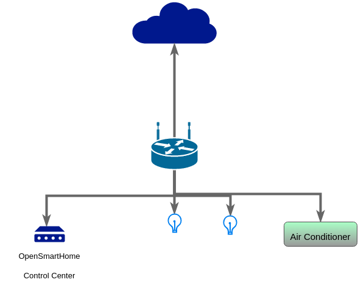

# Core Concept

## Introduction
A centerized control of home devices on one application. It provide an open interface for manifacturer to create their own control panel for their product.

## Interconnection Diagram

## Unit Types
Every unit have a unit type

## Unit Store

## Design

## Interface
